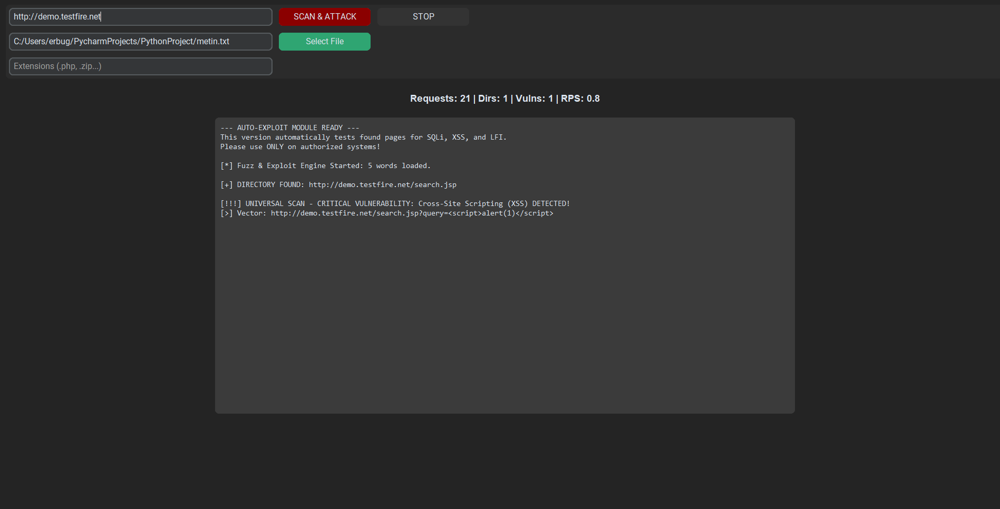

# 🎯 Pro-Fuzzer v4.0 (Auto-Exploit Edition)


**Pro-Fuzzer** is a high-performance, multithreaded web directory brute-forcing tool with an integrated **Auto-Exploit Engine**. It doesn't just find hidden directories; it automatically tests discovered endpoints for common vulnerabilities like SQL Injection (SQLi), Cross-Site Scripting (XSS), and Local File Inclusion (LFI) using universal parameter fuzzing.

 
*(Note: Replace this line with a real screenshot of your tool running!)*

## ✨ Key Features

* **🚀 Multithreaded Engine:** Fast and asynchronous scanning utilizing Python's `ThreadPoolExecutor`.
* **🕵️‍♂️ Universal Parameter Fuzzing:** Automatically tests common parameters (`id`, `cat`, `query`, etc.) on discovered pages.
* **💣 Auto-Exploit Module:** Built-in payload delivery and signature detection for:
  * SQL Injection (SQLi)
  * Cross-Site Scripting (XSS)
  * Local File Inclusion (LFI)
* **🖥️ Modern GUI:** A sleek, dark-themed graphical user interface built with `customtkinter`.
* **📊 Real-time Dashboard:** Live tracking of Requests Per Second (RPS), discovered directories, and critical vulnerabilities.
* **🛡️ Stealth & Error Handling:** Auto-fixes missing URL schemes and handles connection drops gracefully.

## ⚙️ Installation

1. Clone the repository:
   ```bash
   git clone [https://github.com/YOUR_USERNAME/Pro-Fuzzer.git](https://github.com/YOUR_USERNAME/Pro-Fuzzer.git)
   cd Pro-Fuzzer